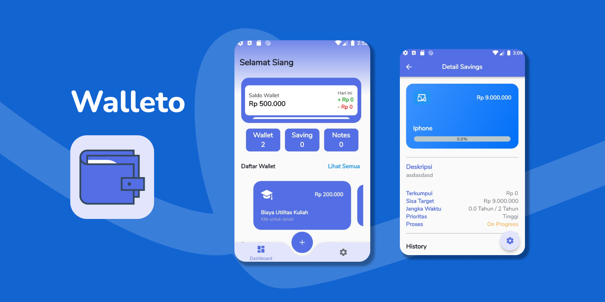

<h1 align="center">
 Walleto
</h1>
<p align="center">
  Money Management App
</p>
<p align="center">
  <a href="https://flutter.dev/"></a>
  <a href="https://dart.dev/"></a>
</p>

<p align="center">
  
</p>

## Table of Contents
- [Introduction](#introduction)
- [Installation](#installation)
- [Features](#features)
- [Dependencies](#dependencies)


## Introduction

Walleto merupakan aplikasi untuk mengontrol keunganan anda serta membantu anda untuk mencapai target menabung sesuai kategori yang dipilih.


## Installation

Clone atau Download dan buka di Android Studio, VSCode, atau IDE / Text Editor Lain nya
```  bash
       https://github.com/Alvin04072001/walleto.git
```  
Sebelum menjalankan aplikasi, terlebih dahulu menggenereate launcher icon dan splash screen dengan perintah berikut:
```bash
        flutter pub get
        flutter pub run flutter_launcher_icons:main
        flutter pub run flutter_native_splash:create
```


## Features
-  Saldo Review dayly
-  Add Wallet 
-  Update Wallet
-  Delete Wallet
-  Detail Wallet
-  History Cash In or Cash Out 
-  Add Saving Target
-  Update Saving Target 
-  Delete Saving Target 
-  Detail Saving Target 
-  History Saving Target 
-  Add Notes
-  Update Note
-  Delete Note
-  Reminder

## Dependencies
- [Hive](https://pub.dev/packages/hive)
- [Hive Flutter](https://pub.dev/packages/hive_flutter)
- [Path Provider](https://pub.dev/packages/path_provider)
- [Provider](https://pub.dev/packages/provider)
- [RxDart](https://pub.dev/packages/rxdart)
- [Logging](https://pub.dev/packages/logging)
- [Flutter SVG](https://pub.dev/packages/flutter_svg)
- [Intl](https://pub.dev/packages/intl)
- [Auto Size Text](https://pub.dev/packages/auto_size_text)
- [Carousel Slider](https://pub.dev/packages/carousel_slider)
- [Percent Indicator](https://pub.dev/packages/percent_indicator)
- [RxDart](https://pub.dev/packages/rxdart)
- [Flutter Speed Dial](https://pub.dev/packages/flutter_speed_dial)
- [Flutter Native Splash](https://pub.dev/packages/flutter_native_splash)
- [Flutter SVG](https://pub.dev/packages/flutter_svg)
- [Flutter Spin Kit](https://pub.dev/packages/flutter_spinkit)
- [Flutter Local Notifications](https://pub.dev/packages/flutter_local_notifications)
- [Flutter Launcher Icons](https://pub.dev/packages/flutter_launcher_icons)
- [Flutter Local Notifications](https://pub.dev/packages/flutter_launcher_icons)
- [Android Alarm Manager](https://pub.dev/packages/android_alarm_manager)
- [Shared Preferences](https://pub.dev/packages/shared_preferences)
- [Animated Bottom Nav](https://pub.dev/packages/animated_bottom_navigation_bar)

